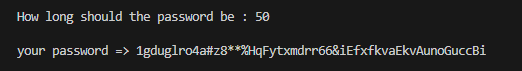
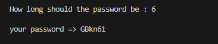

# Password Generator
This is a simple Python program that generates random passwords based on user input. It allows you to specify the length of the password and includes letters, numbers, and special characters in the generated passwords.

# How to Use
Run the program.
You will be prompted to enter the desired length for your password.
The program will then create a random password of the specified length, including a combination of letters, numbers, and special characters.
The generated password will be displayed on the screen.

# Getting Started
To get started, make sure you have Python installed on your computer. You can run the program by executing the Python script, `run.py`.

#### Create a password with 50 characters.

#### Create a password with 6 characters.

# Customize
You can customize the character sets used for generating passwords by modifying the `data.py` file.
